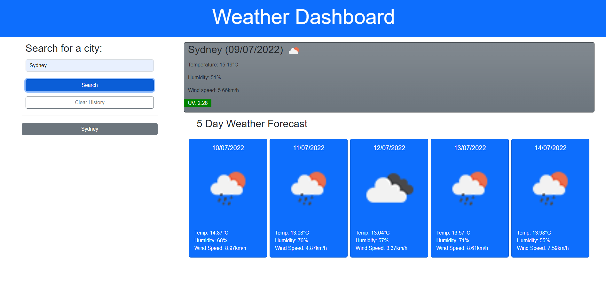

# Weather Dashboard

### By Mackenzie Gray

## Technologies Used 

- HTML
- CSS 
- Bootstrap (CSS Framework)
- JavaScript
- JQuery
- Moment.js
- OpenWeather One Call API

## Description 

The motivation for this project was to create an application to be used by a traveler to check the weather outlook for multiple cities. This will allow the user to plan their trip according to the weather conditions of a certain destination.  

## Outline of codebase writing 

HTML:
- Added Bootstrap stylesheet and Bootstrap core javascript to the page.
- Linking of the CSS to the page.
- Linking of JQuery, Moment.js and my own JavaScript to the page.
- Writing of page structure to include city weather search field with buttons.
- Creating empty sections of the page to be populated once API data is called.

CSS:
- General styling to the page including fonts and colours.

JavaScript:
- Defining global variables for the page 
- Defining click event listeners for search button, clear history button and past city search results buttons.
- Writing of function to take user city input and call OpenWeather One Call API with personal API key to generate latitude and longitude. 
- Writing of function to take latitude and longitude from previous function and call OpenWeather One Call API to generate and populate fields on page with city name, date, weather icon, temperature, humidity, wind speed and UV index.
- Generate 5 day weather forecast data from OpenWeather One Call API and append to the page. 
- Store user searches in local storage and append to the page. 
- Create function to clear local storage. 
- Create function to allow user to click on a city in previous search history and have weather data for that city populate the page again. 

## Website URL

[Click here to view the website](https://mdkgray.github.io/weather_dashboard/)

## Screenshots

## Acknowledgements  

University of Sydney Coding Bootcamp

[OpenWeather One Call API](https://openweathermap.org/api/one-call-api)
